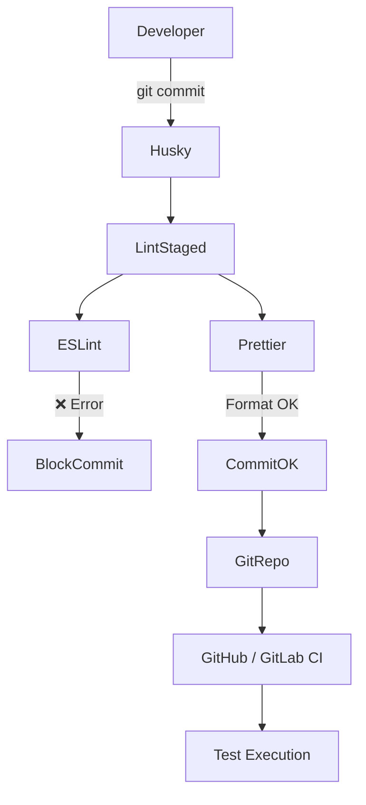

# 🧪 Playwright Test Automation

## ESLint (Strict) + Prettier + Husky Guide

มาตรฐานโค้ดสำหรับ Test Automation (TypeScript + Playwright)\
ใช้เพื่อลด **flaky test**, ป้องกัน bug จาก `async`, และ enforce best practice

---

## 🎯 Goals

- ป้องกัน **test ที่ไม่ await** (ลดปัญหา async ไม่สมบูรณ์)
- **ห้าม** `test.only`, `test.skip` หลุดเข้า repo
- enforce **Playwright best practices**
- **Format โค้ดแบบอัตโนมัติ** ก่อน commit
- **Fail เร็ว** (pre-commit เช็คให้)

---

## 📁 Project Structure

```
.
├── tests/
├── utils/
├── .husky/
│   └── pre-commit
├── eslint.config.js
├── .prettierrc
├── package.json
└── playwright.config.ts
```

---

## 1️⃣ Dependencies

```sh
npm install -D \
  eslint \
  prettier \
  husky \
  lint-staged \
  @typescript-eslint/parser \
  @typescript-eslint/eslint-plugin \
  eslint-plugin-playwright \
  eslint-config-prettier
```

---

## 2️⃣ ESLint (Strict for Test Automation)

`eslint.config.js` (Flat Config)

```js
import js from '@eslint/js';
import tsParser from '@typescript-eslint/parser';
import tsPlugin from '@typescript-eslint/eslint-plugin';
import playwright from 'eslint-plugin-playwright';

export default [
  // Global ignore
  {
    ignores: [
      'node_modules/**',
      'playwright-report/**',
      'test-results/**',
      'dist/**',
      'coverage/**',
    ],
  },
  // TypeScript + Playwright
  {
    files: ['**/*.{ts,tsx}'],
    languageOptions: {
      parser: tsParser,
      parserOptions: {
        ecmaVersion: 'latest',
        sourceType: 'module',
      },
      globals: {
        process: 'readonly',
      },
    },
    plugins: {
      '@typescript-eslint': tsPlugin,
      playwright,
    },
    rules: {
      // Core: TypeScript strict
      ...js.configs.recommended.rules,
      ...tsPlugin.configs.recommended.rules,
      ...playwright.configs.recommended.rules,

      // ✅ ต้องเป็น error (bug จริง)
      'playwright/missing-playwright-await': 'error',
      '@typescript-eslint/no-unused-vars': 'error',

      // ⚠️ downgrade เป็น warning
      '@typescript-eslint/no-explicit-any': 'warn',
      'playwright/no-wait-for-selector': 'warn',
      'playwright/no-wait-for-timeout': 'warn',
      'playwright/no-nested-step': 'warn',
      'playwright/expect-expect': 'warn',
      'playwright/no-useless-not': 'warn',

      // ❌ ปิด rule JS ซ้ำกับ TS
      'playwright/no-networkidle': 'off',
      'no-unused-vars': 'off',
      'no-undef': 'off',
    },
  },
];
```

---

### 🔥 Key ESLint Rules (Why They Matter)

| Rule                          | ป้องกันอะไร             |
| ----------------------------- | ----------------------- |
| `no-floating-promises`        | ลืม await → flaky test  |
| `no-focused-test`             | `test.only` หลุด prod   |
| `expect-expect`               | test ไม่มี assertion    |
| `no-wait-for-timeout`         | wait แบบมั่ว            |
| `prefer-web-first-assertions` | assertion ที่เสถียรกว่า |
| `no-debugger`                 | debugger หลุดเข้า repo  |

---

## 3️⃣ Prettier

**.prettierrc**

```json
{
  "semi": false,
  "singleQuote": true,
  "printWidth": 100,
  "trailingComma": "all"
}
```

---

## 4️⃣ lint-staged (Pre-commit Scope)

**package.json**

```json
{
  "lint-staged": {
    "*.{ts,js,tsx,jsx,json,md}": ["prettier --write", "eslint --fix"]
  }
}
```

- ✔ ตรวจเฉพาะไฟล์ที่ git add
- ✔ เร็ว
- ✔ ลด noise

---

## 5️⃣ Husky (Pre-commit)

**Init**

```sh
npx husky init
```

**.husky/pre-commit**

```sh
#!/bin/sh
# . "$(dirname "$0")/_/husky.sh"

echo "Running ESLint..."
npx lint-staged
```

---

## 6️⃣ Scripts (package.json)

```json
{
  "scripts": {
    "prepare": "husky",
    "lint": "eslint .",
    "lint:fix": "eslint . --fix",
    "format": "prettier --write .",
    "test": "playwright test"
  }
}
```

---

## 7️⃣ Developer Workflow

```sh
git add tests/login.spec.ts
git commit -m "add login test"
```

**What happens?**

- pre-commit
  - ESLint (strict rules)
  - ESLint auto-fix
  - Prettier format
  - ❌ error → commit blocked

---

## 8️⃣ Architecture Diagram (Mermaid)

รองรับ Github / GitLab Markdown



---

## 9️⃣ CI Recommendation (Optional)

**ใน CI ให้รันแบบ no-fix**

```sh
npm run lint
npm run test
```

- ❌ ห้าม auto-fix ใน CI
- ✔ CI ควรเป็น gate เท่านั้น

---

## ✅ Result

- ลด flaky test
- ป้องกัน human error
- Code review ง่ายขึ้น
- Test automation มีคุณภาพระดับ production
